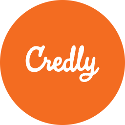

Hi, I’m Loai Walid Hataba
I’m interested in countless subjects and topics you'd lose count before I'm halfway done listing them.
I’m  an undergrad in the Faculty of Computers and Artificial Intelligence, Cairo University.

<h2 style="font-family: Arial, sans-serif; color: #2c3e50; font-size: 19px;">Achievments & Certificates</h2>

- <a href="https://www.credly.com/badges/fccd9caf-2387-4348-93ac-c5d676ab508a/public_url">Junior Cybersecurity Analyst Career Path Exam<\a>
- <a href="https://www.credly.com/badges/ccc1784a-8201-4a87-840a-aa987cc0d4cb/public_url">Network Support and Security (Cisco)<\a>
- <a href="https://www.credly.com/badges/ef55ee7f-5cd5-453b-aee8-893bfbfec20a/public_url">Cyber Threat Management (Cisco)</a>
- <a href="https://www.linkedin.com/learning/certificates/711718319198336a8e9b58c314e823aa670e8568b89427772c19479689d5fba9?lipi=urn%3Ali%3Apage%3Ad_flagship3_profile_view_base%3BF7%2F1bD%2B5SqynTxWcsBEYNA%3D%3D">Career Essentials in CyberSecurity (Microsoft/LinkedIn)</a>
- HCIA-AI (Huwaei)
- <a href="https://www.linkedin.com/learning/certificates/deebc825554d27d064c77a4f4b9e9e43453812359fd9503ef7975732de3de8eb?lipi=urn%3Ali%3Apage%3Ad_flagship3_profile_view_base%3BF7%2F1bD%2B5SqynTxWcsBEYNA%3D%3D">Career Essentials in Software Devolepment (Microsoft/LinkedIn)</a>
- <a href="https://www.credly.com/badges/cfa26c04-0d94-485b-ad20-ee1b7108fabe/public_url">Intro to Cybersecurity (Cisco Netacad)</a>
- <a href="https://www.credly.com/badges/519808d1-07f5-469a-8f05-c67669e38b09/print">Data Fundamentals (IBM SkillsBuild)</a>
- <a href="https://cert.efset.org/sL9JiC">C2 Proficient English (EF SET)</a>
- <a href="https://intranet.alxswe.com/certificates/ncSx5pr6XF">Ai Career Essentials (ALX)</a>
- <a href="https://msa.edu.eg/msauniversity/student-life/student-activities-clubs/mun">2 times Best Delegate (MSAMUN)</a>
- Best Advocacy (ALMUN)
- Python Basic Skill exam (HackerRank)
- <a href="https://www.freecodecamp.org/certification/fcc0fbc68dd-df62-4000-b4be-3c42e6698212/scientific-computing-with-python-v7">Scientific Computation with Python (FreeCodeCamp)</a>
- Web Development Challenger Track (Ministry of Communications and Information Technology of Egypt)
- "In Progress" CS50 2024 (Harvard)

<h2 style="font-family: Arial, sans-serif; color: #2c3e50; font-size: 17px;">Resume</h2>

  
  

<h2 style="font-family: Arial, sans-serif; color: #2c3e50; font-size: 19px;">Languages</h2>

  

  

<h2 style="font-family: Arial, sans-serif; color: #2c3e50; font-size: 19px;">Socials</h2>

  

  

  

  
  
  
  
  

